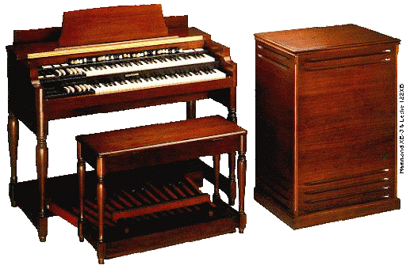
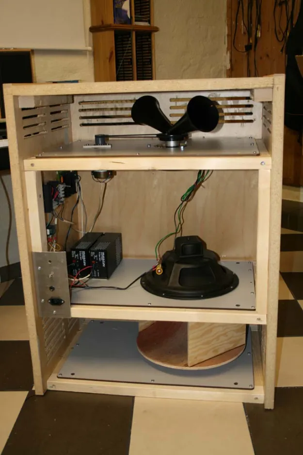
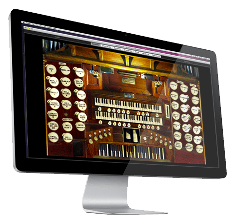

# Lab 13--CPE2600 Final Project

## Project Objectives
* Generate wave files to be used in conjunction with a music software to replicate a hammond organ
* Parallelize multiple file generations to speed up calculations


## Background on the Hammond Organ
The Hammond Organ is perhaps the most famous brand of organs in the world. It is used in everything from gospel, to rock, to jazz, to funk, and even beyond. 


The organ operates by "creating an electric current from rotating a metal tonewheel near an electromagnetic pickup, and then strengthening the signal with an amplifier to drive a speaker cabinet" [1] The sound is adjusted through 9 sliding drawbars. Each drawbar adjusts the volume for a different pitch in the harmonic series. Each tone is only a sine wave, but when combined, many different sounds can be generated.

Even when combined, the static nature of the sine wave still creates a very boring sound. To enhance this tone, a leslie speaker is used. This speaker has two, sepeartely rotating components: a tweeter to handle the high frequencies and a drum for the bass frequencies. These two components rotate at three speeds: Brake, Chorale, and Tremelo. Depending on the selection, the rotation speed varies and modulates the signals to varying degrees. 



# Hauptwerk Virtual Pipe Organ Software 
The Hauptwerk Virtual Pipe Organ is a software that uses audio sampling to allow 
the user to play pipe organs from all over the world. From classical pipe organs built 
in the 15th century to modern concert organs, the software connects the user to 
many different musical experiences. 



### Operating Concept
The software works by taking input from a set of live piano keyboards using the Musical Instrument Digital Interface (MIDI) and playing prerecorded samples accordingly. The samples are looped in real time and played over. Over time, the software has become more complex, physcially modeling pipes, developing impulse responses, taking attack and release samples, modeling persepectives, and much more. 

To sample a rank, or set, of pipes, each pipe is recorded individually and loop points are added into the wav files. There is a wav file for each note, denoted the pipes midi number. 

As an example, an A440 sample would be denoted as ```069-A.wav```.


# The Project: 
While many pipe organ samples exist, there is not a sample set for the hammond organ. The hammond organ is an asset to many musical styles and I wanted to generate samples similar. Other software simulations exist, but they are very expensive. This project provides a cheap, easy, and fast way to generate samples to replicate a hammond. 


